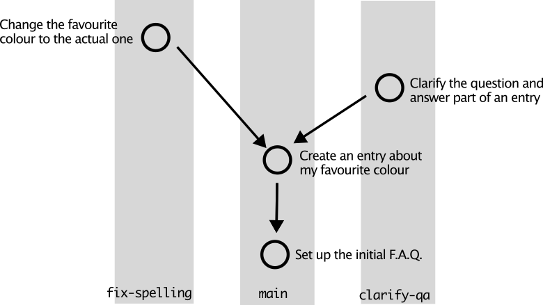
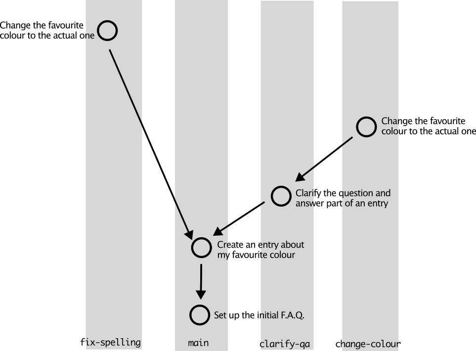
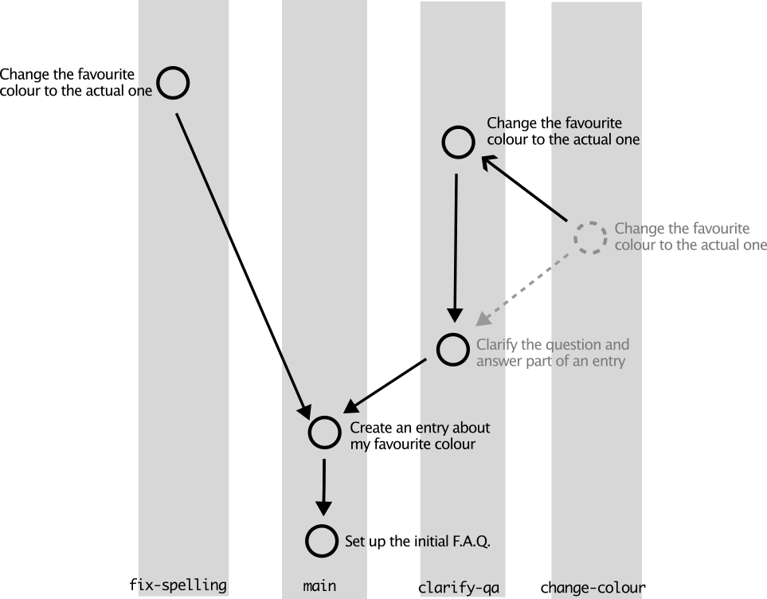
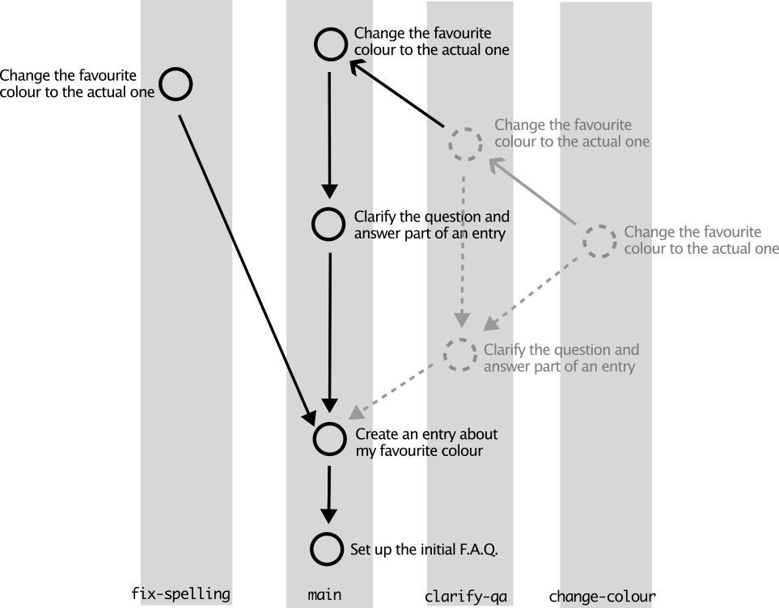
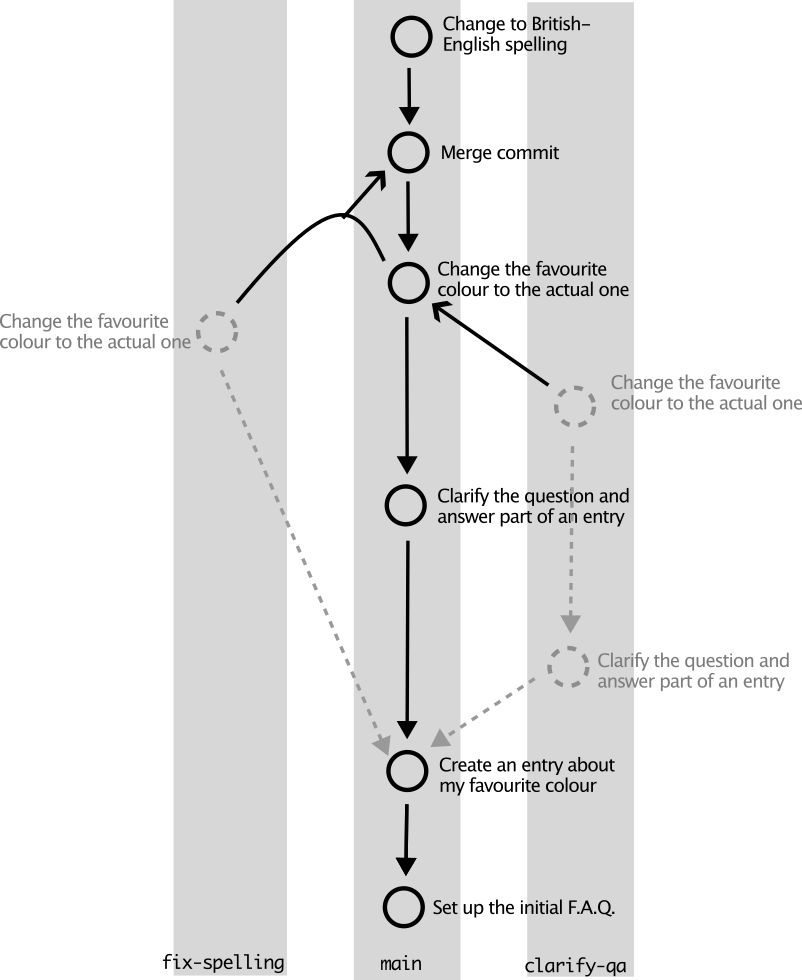

# Advanced Git - API workshop

## Introduction

This workshop follows on from the Git introduction workshop. While you
don't need to have done that workshop, it is assumed your knowledge
and setup of Git matches the results of that workshop. See also the
requirements below.

The steps will go somewhat faster than for the introductory Git
workshop. Then again, a lot of it is perhaps repetition (not from the
introduction workshop, but within the steps themselves).

### Requirements

- have a working git
  - test with `git --version`
  
- know the basic commands, such as `git init`, `git add`, `git commit`.

- have your git config set up with a name, possible email and your
  editor. You can check this with `git config --global --list`, where
  the output should at least have values for `user.name`, `user.email`
  and `core.editor`.

- have a working ssh key & configuration on Github. You can test with
  `ssh -T git@github.com` from the terminal.

- know the basics of moving around a shell in a terminal. We'll be
  using Git from the command line, not through e.g. an IDE or the
  GitHub desktop application. (To save navigating, it is convenient if
  you know how to open a file in your favourite text editor from the
  command line. For Vi(m) and Emacs, that is not a problem. For VS
  Code, you can use `code <filename>` or `code -w <filename>`.)

  You can use any standard terminal application on Linux or macOS. On
  Windows, perhaps the best setup is install and run the WSL (Windows
  Subsystem for Linux), and then install and use the Windows Terminal
  application, where you can then select the WSL to work in. You then
  have a nearly full Linux system that you can work with, while using
  a suitable Windows application as your terminal.

  For shell, bash or zsh are advised (bash is the default on most
  Linux distributions, while zsh is the default on macOS).
  
## Part 0: setup

_Your collaborators thought it would be a good thing that their
project has a frequently asked questions (FAQ) page for people using
it, and they've asked you to add some questions with answers. You have
just forked the main project repsitory to your local GitHub account,
and then cloned it onto your local machine. There is a file with a
single question, `faq.txt`, as a starting point._


- on GitHub, fork from `antonpannekoek/git-advanced`

- create or cd to a good base directory, e.g. `$HOME/workshops`, on your
  local machine

- Clone your fork of the repository to this base directory: `git clone
  git@github.com/<your-user-name>/git-advanced`.

  This uses the ssh variant, not the https variant; you can see this
  from the use of `git@github.com` at the start.

  You can find the correct URL under the green "Code" button on
  GitHub, and then under the "SSH" tab.

- cd to your local copy of the repository: `cd git-advanced`.

Note: The directory on your system does not need to be named the same
as the repository, but it's standard and practical to do so.


### Non-GitHub setup

If you don't yet have your GitHub account set up, you can follow along
for the first part (branches, merging and merge conflicts) locally, by
creating a new repository and adding a single file, `faq.txt`, and add
the text below:

```
What is your favorite color?

Blue!
```

Save the file, and commit it to your local repository with a commit
message such as "Set up an initial F.A.Q.". For the later parts, you
will need a working GitHub account.


## Part 1: branches and merges on your local machine

Preface: the following shows a fabricated way of using multiple
branches, making small commits, stashing changes, and finally merging
changes together, all for one file. The workflow, however, may be
something you could be using in a large project that you are actively
working on. It also serves as a feel to what can be done with Git, so
that you are hopefully less confused if you start using these
commands.


Let's check the status of our repository, and the _branch_ we're on:
```
git status
git log
git branch
```

A branch is like a separate directory, with a potential different
version of your repository. If you have multiple branches, you can
switch between them, and the files in the repository (but only the
ones tracked by Git!) change accordingly. Git handles this for you
under the hood.

Note: Always work on branches; never make changes directly on the main
branch.

(You'll note that for the setup, part 0, we cheated, and added a
commit on the main branch. Please ignore this detail for the sake of
convenience.)


### Making a change on a branch

_You realise all text in the main project is in British-English, and
the FAQ should follow suit. You create a branch to fix the
spelling._

Create a branch and switch to it
```
git branch fix-spelling
git branch
git switch fix-spelling
git branch
git status
git log
```

`git branch` shows all available branches, with an asterisk `*` in
front of our current branch. `git status` will show a line like "On
branch fix-spelling" near the top of its output.

`git log` still only shows the single commit: the branch is current
still a copy of main. Let's change that.

-------

Open the `faq.txt` file in your editor and change "color" to "colour"
(don't change "favorite"; not yet). Save the file.

Let's see what we have changed:
```
git diff
```

As it name implies, `git diff` shows the changes made to our
repository when compared to the current commit. By default, it shows
all changes to all files: the command can be followed by a filename to
show only changes made to that file: `git diff faq.txt`. Which in our
case is of course the same, since there only is one file.

Important to note is that Git shows the full line(s) that differ: Git
is very much line-based.

Add the file to Git (don't commit yet):
```
git add -u .
```

There is two extra things

- the period `.` adds the whole directory. This is convenient if you
  have multiple files that you want to add as a single commit.

- the `-u` option only adds updated (=changed) files that Git
  tracks. If there were another file in the directory, that was never
  committed to Git, `git add -u` would ignore that file.

So the above adds all files that have changed, which in our case is
just one file.

If we now run
```
git status
```

we see "Changes to be commited". These are "staged", and while `git
diff` will show no changes anymore, `git diff --staged` will show the
changes we are about to commit:

```
git diff
git diff --staged
```

`git diff --staged` is useful in case you have added multiple changes,
and aren't really sure what the total changes are that will go into
the commit.

Note that status also says how you can remove the pending changes for
a file: `git restore --staged <filename>`.

`git status` is very useful, and sometimes shows helpful hints.

Finally, let's commit this change:

```
git commit -m "Change to British-English spelling"
git log
git status
```

Note: One style of (good) commit messages is to be short (one line,
50-60 characters maximum), with an active verb in present
tense/infinitive (think of it as: "This commit will \<commit
message\>"), start with a capital letter and have no ending
period. More importantly perhaps, the message should indicate the
intent, not so much the actual change (of course, this is not always
feasible, and commits that correct typos suffice with a message such
as "typo", though nicer is perhaps "Correct a few typos").


We're still on the fix-spelling branch. Let's switch to the main branch:

```
git switch main
```

and check the file with a simple `cat`:

```
cat faq.txt
```

(cat is a basic Unix command; convenient for viewing (short) text files.)

Lo and behold, "color" is still spelt (spelled) in American-English on
the main branch. Which is the purpose of Git: separate branches contain
separate versions.

### Making a different change on a new branch

_At this point, a collaborator sends you a message, saying that some
people have problems distinguishing the question from the answer. A
single question mark at the end of a sentence is not always that
clear, so you decide to fix that as well._

Create a new branch, starting from main, for this change. We start
from main, since this change is independent from our previous change
(also so this tutorial can teach some extra Git usage and workflows).

```
git switch -c clarify-qa
git status
git log --oneline
```

The `-c` (`--create`) option to `git switch` creates a branch and
switches to it in one go.

The `--oneline` option to `git log` makes reading commit message (once
there are many) easier, though it will not show an explanatory longer
log message. `git log --oneline` is why you should use concise and
clear first lines for your Git commit messages.

Open the `faq.txt` file and add a "Q: " and "A: " in front of the
question and answer, like so:

```
Q: What is your favorite color?

A: Blue!
```

Save the file, check the changes, and commit the file:
```
git diff
git add -u .
git commit -m "Clarify the question and answer parts"
```

Note: if you run `git commit` without the `-m <message>` option, a
file, `COMMIT_EDITMSG`, will be opened in your default Git editor,
where you can edit the commit message on the top line. This is
particularly useful when you want to add more explanation below the
main line: leave a blank line after the top line, then type your
explanation (do wrap paragraphs around 70-80 characters). You can
ignore all the below it starting with a comment character `#`; which
is also what those comment lines tell you.

Once you have saved the file and closed the editor, git will perform
the actual commit. To cancel a commit while editing the commit message
in an editor, remove all normal lines (or comment them), so that there
is no commit message, then save and close.

For VS Code users doing this: make sure your editor waits for you to
save and close the file / tab, so that control returns to Git on the
command line. For this to work, your Git editor should be `code -w` or
`code --wait`.

#### Visualising the repository

If we would need to create a visual overview of the repository, it
might be something like the following:



Each of the two new branches has a single commit, and both point back
to the their parent in the `main` branch (note that commits always
know about their ancestors, but nothing about their descendats: they
can't see the future).


### Stashing changes

_You now realise that your actual favourite colour is not blue, it is
yellow. Before you are cast into the Gorge of Eternal Peril, you
decide to quickly change this. In your haste, you forget to create a
new branch from main, but you keep working on the current `clarify-qa`
branch._

Edit the `faq.txt` file to now be
```
Q: What is your favorite color?

A: Yellow.
```

_Now that you see the question again, you realise that you didn't
change favorite to favourite! Before you forget, you should correct
that first._

We're going to switch to the `fix-spelling` branch, even if we haven't
committed our recent change yet.

```
git switch fix-spelling
```
Uh oh, there is an error message:
```
error: Your local changes to the following files would be overwritten by checkout:
       faq.txt
Please commit your changes or stash them before you switch branches.
Aborting
```

Git is not happy. The thing is, the recent change you made ("Blue" to
"Yellow") is not yet stored by Git, and it conflicts with what is
stored in the `fix-spelling` branch.

You could undo the changes, then switch branches, but in reality, you
probably don't want to do that. Instead, you'd like to put these
changes aside, fix things in the other branch, got back to the current
branch, and then bring these changes back. Luckily, you can, with `git
stash`.

`git stash` puts your recent changes on a "stash", so they're
(temporarily) out of the way. Let's do that:

```
git stash
```
you can see what files are on the stash:
```
git stash show
```
and for a diff, you need the `-p` or `--patch` option:
```
git stash show -p
```

Now we can switch to the other branch without Git complaining:
```
git switch fix-spelling
```

The stash is still there: it's branch-neutral.
```
git stash show
```

Let's fix the spelling: open the `faq.txt` and change `favorite` to
`favourite`. Note that the "Q: " and "A: " are missing in this
version, and the color is still blue.

Add the file
```
git add -u .
```

We'll do the commit a bit different. Because this should still be part
of the previous commit on this branch, the "Change to British-English
spelling" one. As long as this branch is not merged anywhere, and
no-one is actively using it, you can amend the most recent commit:

```
git commit --amend
```

This will open your text editor, with the commit message of the last
commit on this branch. Check that it all still looks correct, save and
close, and check the log:

```
git log --oneline
```

Warning: do not amend commits that are already used by others (when
e.g. published on GitHub); this will alter (Git) history, and your
history will be different than that of other people, making
collaborating on the same code hard to impossible.

### Git diff for differences between commits

To verify that now both words are changed when compared to the
previous commit, we can use `git diff` again, but slightly
differently.  Previously, `git diff` was used to show impending
changes. But we can also use it to compare between commits:

```
git diff HEAD~1..HEAD -- faq.txt
```

`HEAD` is a special indicator for the tip of the current branch, the
head. `HEAD~1` means one commit before HEAD (and `HEAD~2` is two
commits before, etc). So we are comparing the previous penultimate
commit with the current *on this branch*. `faq.txt` is of course the
file used for comparison. We need the `--` so that `git diff` can
distinguish the commit part from the file part (you could have a file
called `HEAD`, although it's not recommended).

This way, you can compare any two commits, although then you may not
want to use `HEAD`: you can always use the commit hexadecimal hash
that is listed with `git log`, and generally, the short 7-character
version from `git log --oneline` is good enough. These hashes differ
per repository, user and time, so you'll have to look them up
yourself. For me, it would be

```
git diff 7800594..20dbcc5 -- faq.txt
```

It is practical for a diff-command to have the older file on the left,
and the newer version on the right. That way, lines prepended with a
`-` are the old ones, and the `+` ones are the new ones.

(For those who really like shortcuts, `HEAD` can even be shortened to
`@`, and a lone `~` means `~1`, so `git diff @~..@ -- faq.txt` is
still the same. Which can then be shortened to ``git diff @~ --
faq.txt`, since the current HEAD is the default to compare
against. And since in this repository, `faq.txt` is the only file,
`git diff @~` will do the same. Just be careful not to confuse
yourself.)

### Switching to a branch mid-work

_You've fixed the spelling now completely, time to work on your favourite colour again._

Switch back to the other branch, and grab the changes from the
stash. The command for that is `git stash pop`.

```
git switch clarify-qa
git stash show
git stash pop
# show an empty stash
git stash show
```

Always be careful that you are on the correct branch when you `pop`
the stash; Git will happily try to apply any changes in the stash onto
your current branch, with possible conflicts as a result; not fun.

(Summary: `git stash` to store changes (temporarily), \<do other stuff\>,
`git status` to see what is in the tash, and `git pop` to restore
changes.)


Since we haven't commited (or stageD) these changes yet, we can
actually still switch to a new branch, just only from the current
branch. To show, let's do that:

```
git switch -c change-colour
```

This is convenient, because you may start to make changes on, say, the
main branch, and realise halfway that you shouldn't really work on
main, but on a separate branch. You can always create one at the point
and switch to it. Once, however, you have made a commit, you can't
really change that commit to a new branch.

Add the change and commit
```
git add -u .
git commit -m"Change the favourite colour to the actual one"
```

Phew, we're (almost) done.


Now, all of the above is a lot, and very fabricated. The reason for
this example is that in practice, for larger projects, you may have
multiple branches, and work on them near-simultaneously (fixing a bug
on one, adding a feature on another). And all of this work may be done
in a single, local, repository, on your machine. Which is roughly what
the above shows.

#### Overview

The visual representation of the repository could now be like




### Merging the changes back into main

We are ready to merge all of this into the main branch, one branch at a time.

We'll first merge the `change-colour` branch into its direct
parent-branch, `clarify-qa`. We could also merge `change-colour`
directly into the `main` branch, and that would automatically merge
the `clarify-qa` branch with it into `main`. This is because we're
actually merging the relevant commits into main, and `change-colour`
also contains the commits fromt he `clarify-qa` branch (which you can
easily see with `git log`).

We switch to the branch into which we'd like to merge:

```
git switch clarify-qa
```

Then we merge

```
git merge change-colour
```

That was easy. Git automatically uses the current branch as its target
branch, and you only have to apply the source branch. Check `git log`
to see that the colour change commit is on the `clarify-qa` branch as
well.

#### Visually

Visually, you could draw this as follows



The grey commits still exist on their respective branches, but are
"superseded" by the commit on another branch (these are in fact the
same commits).


Now merge this into the main branch:

```
git switch main
git merge clarify-qa
git log --oneline
```

We can also see what has all been merged into the main branch:

```
git branch --merged
```

will list the `main` branch itself, and the two branches that were
merged into `main` (directly and indirectly): `clarify-qa` and
`change-colour`.

This looks as follows



#### Merge the other branch

Great! Now let's merge the other branch. We're already on the main
branch, so this is easy:

```
git merge fix-spelling
```

Uhoh: another error from Git:

```
Auto-merging faq.txt
CONFLICT (content): Merge conflict in faq.txt
Automatic merge failed; fix conflicts and then commit the result.
```

There is a merge conflict, because we have changed the same line; Git
is very line-based when trying to merge things. `fix-spelling` has
changed the first line, and so has the `clarify-qa` branch.

Git tells us to fix the conflict, and then commit the result. But
let's first check the status

```
git status
```

which shows `faq.txt` as "both modified". When we look at the file
(with `git diff` to see the actual problem points, but `cat faq.txt`
also shows it for such a small file):

```
<<<<<<< HEAD
Q: What is your favorite color?
=======
What is your favourite colour?
>>>>>>> fix-spelling

A: Yellow!
```

The `<<<<<<<`, `=======` and `>>>>>>>` divide the problem area into
two parts: between `<<<<<<<` and `=======` is our current (`HEAD`)
variant, while the other part is what is incoming from the merge.

To fix this, we'll need to edit the file, remove the three conflict
markers, and provide a solution to the line of interest. In this case,
the final line should be

```
Q: What is your favourite colour?
```

(You'll see that the answer line, while it has changed from Blue
to Yellow, does not cause a merge conflict: there was no change on the
`fix-spelling` branch, so Git can safely apply the change from the
`change-colour` branch during the merge.)


So go ahead, open the `faq.txt` in an editor, remove the three marker
lines and replace the remaining double question line with the single,
combined line above.

After this, we look at the status
```
git status

On branch main
All conflicts fixed but you are still merging.
  (use "git commit" to conclude merge)

Changes to be committed:
	modified:   faq.txt
```

It says "All conflicts fixed", but there are "Changes to be
commited". Let's do that:

```
git commit
```

Your editor opens up, this time with a preset Git commit message:
"Merge branch 'fix-spelling'".

Generally, this is a fine message to leave in. There are exceptions
where you'd like to avoid an extra commit message, but overall, these
messages just happen quite naturally when working with (large)
codebases and Git.

So save the file and exit. `git status` will show a clean repository,
and `git log --oneline` shows something like

```
9fd955f (HEAD -> main) Merge branch 'fix-spelling'
c0381d5 (clarify-qa, change-colour) Change the favourite colour to the actual one
fad639e (fix-spelling) Change to British-English spelling
aa5c99d Clarify the question and answer part of an entry
7800594 Create a FAQ with a first question and answer
```

Note how the branches are matched: Git finds the branches with the
relevant commits (check also `git branch --merged`). More importantly,
the commit that caused the merge conflict, "Change to British-English
spelling", is still there. As is the commit that fixed the merge
conflict.

Also: don't delete the `fix-spelling` and `clarify-qa` branches!

The `change-colour` branch can be deleted though:

```
git branch -d change-colour
```

The final result looks like



A few notes:

- there may be more merge conflicts in the same file, in which case
  there will be multiple sections with `<<<<<<<`, `=======` and
  `>>>>>>>`. So be aware where one section starts and ends.

- You don't have to really know what is the "left" and "right" part of
  the two sections. Just look at what the logical solution should be,
  then combine the code to end with that solution, and remove the
  markers. Just make sure you don't leave duplicate lines.

- Some editors try to help with merge conflicts, showing the two
  versions side-by-side. This may be useful, but I find the
  single-editor approach generally easier.

- the empty line between the question and answer here is
  important. Git often takes lines together, and having these two
  lines not separated by an empty line, would have put them both
  inside the merge conflict, even if the answer part does not cause a
  merge conflict. The empty line

- if you get confused by a merge conflict: don't panic! You can always
  abort the merge (`git merge --abort`) to return to safety, then find
  your local Git guru to help you out.

And a special mention to a big annoyance of mine: trailing whitespace

#### Trailing whitespace

Trailing whitespace are spaces or tabs at the end of a line, or empty
lines at the end of a file (but it's good practice to end the last
line of a file with a newline, though). They don't contribute
anything(*), but causes unnecessary diffs and merge conflicts. __Avoid
trailing whitespace as much as possible__: find the command for your
editor that removes trailing whitespace, or better yet, use a proper
formatting tool for your favourite language(s), and apply that for
every commit.

(*) the one point that I know of where it can matter is for Markdown,
where two spaces at the end of a line causes a line break (instead of
a paragraph break); which generally is not necessary, and a normal
paragraph break is completely fine 99% of the time.


### Some take-aways

- be aware of what branch your working on

- changes in files on one branch are not shown when on another
  branch. Very useful when experimenting with code.

- check your status

- git diff for checking changes; also between branches

- only merge into main

- you can merge conflicts; they are not as scary as one might think.


## Part 2: branches and merging on your local GitHub account

In this part, we'll be using our local GitHub fork to update
things. We'll put the branches into the fork, so that there is a
convenient backup as well on GitHub of our code.

First, we'll cheat a bit, and set the `main` branch back to its
starting point. Beware: this (resetting a branch) is not something
you'll often (want to) do; here, it's mainly out of convenience to get
back to a clean starting point of the `main` branch.

```
git switch main
git reset --hard origin/main
git log
```

(`git reset --hard` may lose work, so try and avoid it in general.)

The last `git log` should show only the barebones `faq.txt`: an empty
file. And `git branch --merged` will show neither of the two branches
are merged.

### Pushing branches to GitHub

First, we'll check whether our local repository knows about our fork
on GitHub:

```
git remote -v  # explain what we see
```

This will show two lines referencing our fork on GitHub: one for fetch
and one for pushing (those terms will be explained along the
way). Both lines have a name, called "origin". While this name is
flexible and could be anything, "origin" is the common default for
your local "online" repository (whether on GitHub, GitLab or another
remote system): it's the default reference name for anything you
cloned, as we did at the start (`git clone git@github.com/....`).

Switch to the `fix-spelling` branch:

```
git switch fix-spelling
```

Now, we'll *push* this onto the "origin" remote:

```
git push origin fix-spelling
```

This pushes the current branch to the "origin" server (i.e., GitHub),
onto a branch called `fix-spelling`. For good practice, keep the
branch name on both sides the same, as not to confuse anyone.

If you now navigate to the GitHub fork in your browser, you'll see the
new branch. Actually, you'll probably see a large banner with a green
background suggesting to make a "pull request". Ignore this banner for
now.

Instead, check out the list of branches in the central menu (i.e., not
the one at the top, but just below the repository title). You should
see a `main` branch and a `fix-spelling` branch.

If you find the second menu item, "2 Branches", you can see both
branches, subdivided in a few categories. Notably, you can see that
`fix-spelling` is 1 commit ahead of `main`, which is indeed what we
expect.

Back to the terminal, to push the other branch:

```
git switch clarify-qa
git push origin clarify-qa
```

On GitHub, you'll see the new branch in your list of
branches. `clarify-qa` has two commits.


### Updating `main` on GitHub

We'll now use GitHub to perform a "pull request" from the "clarify-qa"
branch to our "main" branch.

We'll ignore the "pull request" banner, since this is only available
for a brief while, and will be gone if you would do this tomorrow.

Navigate to the list of branches, and select the ellipses ("...") for
the row with the `clarify-qa` branch; select "new pull request".

We'll end up on a new page, which shows, from top to bottom:

- the branch / repository we are merging into; and the branch we're
  merging from. Make sure you merge into "base: main", so it all stays
  in our local fork. Don't try and merge (yet) into the forked
  repository!

- A title. By default, this is the name of the branch. You can edit it
  to your liking, but keep simple. E.g., "Clarify questions and
  answers".

- A description. This is not a description for a single commit, but
  for the whole branch. So this explains what the intention is for
  this merge. We'll leave it blank for this simple merge.

- Then it shows the commits that will be merged

- At the bottom, perhaps the most interesting part, it shows the
  changes that will be applied during this merge.

Take a minute to verify that everything looks ok, then hit the green
"create pull request" button.

#### Aside: why is it called "pull request"?

GitHub uses the term "pull request", because you are "asking" someone
(in this case, yourself) to "pull" the changes from a certain branch
into your main branch / repository.

Other Git websites / facilities may use a different term: GitLab calls
it "merge request", because you are asking someone to "merge" the
changes into their branch / repository.

Also, "pull request" is often abbrevated to PR.

#### Merging the pull request

Once you've clicked the button, GitHub will take a few seconds to
verify everything is in order, and the changes can be merged.

If you see a green "Merge pull request" button, you're good to
go. Note that in the menu above, you can still verify the commits and
changes that go into this merge.

Click the button, accept the default merge commit message, and confirm
the merge.

Note: GitHub always creates a commit message for a merge, even if
there was no conflict. This is in contrast to what Git does by
default, as we saw on our local machine for our first merge.

Once the merge is confirmed, find your list of branches again. This
should now show that

- clarify-qa is 1 behind of main. That 1 commit is the merge commit.

- fix-spelling is 3 behind, and 1 ahead of main. Those 3 commits are
  the 2 commits from clarify-qa plus 1 merge commit; the 1 ahead is
  the actual spelling fix commit.

"ahead" and "behind" are standard terms that are used in Git, to
indicate the status of a branch compared to another branch, with
respect to their commits. You'll occasionally see this when you run
`git status` on the command line: it may tell you `main` is behind or
ahead of `origin/main`, for example; it may even be both behind and
ahead (although for the `main` branch, you don't really want this to
be the case. It probably means you have made changes on main itself,
not on a branch. Or merged locally, instead of on a remote).

#### Merging a branch with a conflict

Let's try and merge the `fix-spelling` branch. We already know that
there likely will be a problem; let's see how to solve that when
merging on GitHub.

Select the ellipses for `fix-spelling` and select "create pull
request". On the next page, again ensure you merge into "base: main",
adjust the PR title as wanted, and click "Create pull request". GitHub
will take a few seconds, only then to realise that there is a
conflict.

GitHub suggest a web editor to fix the conflict, but we'll do it
locally on our own machine.


#### Updating our local branches

Go back to your local machine. We'll want to update our local main, to
keep tracking the GitHub main.

Note: we don't work on main (i.e., create new commits), but we can
(and likely want) to keep main up to date with our remote.

```
git switch main
git fetch origin
git rebase origin/main
```

The second line above "fetches" the changes to main from our origin
(hence the term "fetch" for the remote). The third line is the
important part: it merges the changes from the `main` branch on the
`origin` remote into the current branch. Note that without the `git
fetch main`, nothing happens, since our local Git won't get informed
about changes on the `origin` remote.

You can now run the usual status checks:
```
git status
git log
git branch --merged
```

We see that the commits from the `clarify-qa` branch are merged into
main, and there is an extra commit, the merge commit that GitHub
created when we merged `clarify-qa` into `main`.


#### Rebase and merge

What is up with the `rebase` command though? It is very similar to a
`merge` command, but every so slightly different. In particular, it
tries to avoid creating an additional merge commit. 

Rebasing is sometimes preferred over merge for updating local branches
with remote changes: it avoids additional merge commits. Merge commits
tend to be a good thing when merging a branch into the main branch,
but you may want to avoid it when updating a non-main
branch. Otherwise, you'll have a merge commit from merging
`origin/main` into the `fix-spelling` branch, and then another merge
commit from merging `fix-spelling` into `origin/main`.

**So, merge branches into `main` (or `origin/main`), rebase `main` or
`origin/main` onto other branches.**

As to updating our local `main` with `origin/main`: you can go both
ways. If you didn't change `main` in any other way (adding a commit,
merging a local branch), rebasing and merging should have the exact
same effect: `git switch main; git merge origin/main` or `git switch
main; git rebase origin/main` results in the same. Which is a good
reason to keep the local `main` clean.


#### Update the `fix-spelling` branch

We already fetched the changes, so let's update `fix-spelling`. This
branch is yet unmerged, and we'll first need to add the changes from
the GitHub `main` branch to `fix-spelling`:

```
git switch fix-spelling
git rebase origin/main
```

As expected, we get a merge (rebase) conflict. The message is a bit
different than for a merge conflict, since we are rebasing, but the
actual problem, and its resolution, are the same.

```
Auto-merging faq.txt
CONFLICT (content): Merge conflict in faq.txt
error: could not apply f615a43... Change to British-English spelling
hint: Resolve all conflicts manually, mark them as resolved with
hint: "git add/rm <conflicted_files>", then run "git rebase --continue".
hint: You can instead skip this commit: run "git rebase --skip".
hint: To abort and get back to the state before "git rebase", run "git rebase --abort".
Could not apply f615a43... Change to British-English spelling
```

Git gives us three options:

- We can abort the rebase if we don't know what to do

- Skipping is probably not what you want.

- Continuing can only be done after fixing the conflict, but is the way forward


You'll also note that, perhaps confusingly, we're also somewhat in the middle-of-nowhere:
```
git branch
```

shows

```
* (no branch, rebasing fix-spelling)
  clarify-qa
  fix-spelling
  main
```

Fixing a rebase-merge conflict temporarily takes us out of time and
space. Let's proceed anyway, and see where we come back to our
`fix-spelling` branch.

The conflict can be fixed as previously: open the offending file(s) in
an editor, then find the conflict indicators, remove the indicators
and fix the lines so it ends up the way you want. In our case, this

```
<<<<<< HEAD
Q: What is your favorite color?
=======
What is your favourite colour?
>>>>>>> f615a43 (Change to British-English spelling)
```

should be edited into this

```
Q: What is your favourite colour?

A: Yellow!
```

(double check the spelling.)

Save the file, close the editor window, and now on the command line type

```
git status
```

You'll see there are changes to be commited. You can view these staged
changes with `git diff --staged`, to see if it looks correct.

Let's commit the changes:
```
git commit
```

This `commit` command was provided without the `-m` option, and when
opened in your editor, it will already show a correct commit message:
"Change to British-English spelling". So we just have to close the
window (there's even no need to save the message)

We're not done yet! As `git status` shows

```
git status
interactive rebase in progress; onto c536f48
Last command done (1 command done):
   pick f615a43 Change to British-English spelling
No commands remaining.
You are currently editing a commit while rebasing branch 'fix-spelling' on 'c536f48'.
  (use "git commit --amend" to amend the current commit)
  (use "git rebase --continue" once you are satisfied with your changes)

nothing to commit, working tree clean
```

there are no problematic files, but we are in the middle of a rebase
still. The last bit we need to do is

```
git rebase --continue
```

and we're back on our `fix-spelling` branch, this time with the
changes from `origin/main` included and the conflict resolved.

`git log` shows all the commits, including the merge commit from
earlier on GitHub, but no merge commit from our above conflict
fix. This is the point of rebasing: it looks like we only added the
commit to change the spelling on top of the existing commits.

Now we push our branch to GitHub:

```
git push origin/fix-spelling
```

and we get an error

```
 ! [rejected]        fix-spelling -> fix-spelling (non-fast-forward)
error: failed to push some refs to 'github.com:evertrol/advanced-git.git'
hint: Updates were rejected because the tip of your current branch is behind
hint: its remote counterpart. Integrate the remote changes (e.g.
hint: 'git pull ...') before pushing again.
hint: See the 'Note about fast-forwards' in 'git push --help' for details.
```

The reason behind this error is that rebasing alters (Git) history. It
is all fine locally, on a non-main branch on our local machine, but the
remote repository now doesn't know how to handle this altered history.

We, in fact, want to keep this altered history, and replace the
`fix-spelling` history on GitHub. If you are sure no-one has been
using your `fix-spelling` branch from GitHub (to not mess up their
history), you can force-push this branch. Do this *only* for non-main
branches, and *only* from your local repository to your local GitHub
remote.

```
git push origin fix-spelling --force
```

If we now go to the GitHub page for the `fix-spelling` pull request
(you probably still have it open), we'll see that there now is no
merge conflict. We can safely merge this into the GitHub `main` branch.

Let's finally update our local `main` branch, as before:

```
git switch main
git fetch origin
git rebase origin/main
git log --oneline
```

(you can `git merge origin/main` instead of `rebase` if you like; it
should have the exact same result.)

and we'll see all our commits, plus the GitHub-added merge commits.


A note on `git pull`:

The `git pull` command combines `git fetch` and `git merge`: it
fetches the changes, and then applies them. I tend to avoid it, so
that I have a better feel of what is going on, but that is a personal
preference. Note that `git pull` merges by default. If you like to use
it for rebasing instead, use `git pull --rebase`.


### Takeaways of part 2

- Use branches on github (or any other remote)

  `git push origin <branch>` to store changes on GitHub (works as a
  backup as well). Advantage: other people could now also try out your
  changes, without making a mess of their main branch

- Still only merge into main

- Update local main with the changes from remote main

- git push --force only after resolving a merge conflict (or some
  other conflicting changes)

- `git fetch; git merge` (or `git pull` to get chanages from GitHub back into your main branch

- apply new changes in main also to branches as needed. These are
  branches that won't yet be merged into main (check with `git branch
  --merged`

The above shows how to push branches to GitHub, merge those branches
into our main branch, and resolve conflicts locally if branches can't
be merged neatly.

It has also introduced rebasing next to merging, since some project
workflows prefer rebasing over merging (for pull requests). For
example, the AstroPy project tells you to [avoid merge
commits](https://docs.astropy.org/en/latest/development/development_details.html#do-not-create-a-merge-commit). (The
AstroPy developer documentation overall is a good document for
contributing to a large project, including altering your code once
there are comments to a pull request.)

#### When to merge, when to rebase:

- merge from a branch into main

- rebase from main onto a branch

- from main to main: merge or rebase should have the same effect, with no conflicts


## Part 3: synchronizing with upstream and submitting a pull request

To start, we'll add a reference to the original repository as a new remote:

```
git remote add upstream https://github.com/antonapannekoek/advanced-git.git
git remote -v
```

(To find the URL, you can go to your fork on GitHub, and on the main
page find the original URL just under the title of the
repository. Follow that link, then click the green "Code" button, and
this time, copy the URL from the "https" tab.)

The name of the remote is upstream. This is the standard name used to
refer to the original repository, which is the actual reference on
which your repository is based. The URL uses https here, which is more
common for a read-only repository. `git remote -v` shows "(push)"
access to the upstream repository, but this won't work unless you have
admin rights.

This "upstream" remote is now our "ultimate" source of truth, in
particular its `main` branch: we should always bring our branches
up-to-date with upstream if we are making changes.


### A few cheats to get back to our starting point

We should also bring our own repository, both the fork on GitHub and
the repository on our local machine, back to a more pristine state,
without any merges. Again, we cheat somewhat.

We'll first reset main to its starting point. We can't do that on
GitHub, so we do that locally again, then force-push to origin/main,
so that both our local and origin `main` branches are reset.

We can't use origin/main to reset to, since that is updated to the
most recent commit. Instead, we'll reset to `upstream/main`, since
that is now our source of truth. And we still have that very first
commit in common with upstream, as you can see with `git log
--oneline`, for example.

```
git switch main
git log --oneline
```

If you see `(upstream/main)` listed with the first commit, you can
reset to this:


```
git reset --hard upstream/main
git log  # check that we only have the original, one commit
git push origin main --force  # update our GitHub fork as well
```

Normally, we wouldn't work on main this way (no push, only
pull/fetch), so this is a convenience exception for this tutorial!

The `clarify-qa` branch is still good, but the `fix-spelling` branch
is more problematic to reset: there are a few commits in between the
original commit and the spelling-change commit. So here, we restore to
the original commit, then just manually add the spelling-change commit
back:

```
git reset --hard origin/main  # can use origin/main now, since it has been reset
# Edit the file and change the spelling
git add -u .
git commit -m"Change to British-English spelling"
git push origin fix-spelling --force
```

We now like to merge our changes on the two branches into the original
repository.

### Create the pull requests

Since we ignored the pull request pop-up on GitHub, now navigate to
our branches, find the `clarify-qa` branch, and click the ellipses
("..."); select "New pull request", and ensure that the base
repository to merge into is now "antonpannekoek/advanced-git". This is
the default, so you don't have to change that.

Create the pull request.

From this point on, there is not much you can do: the admins of the
upstream repository will get a notification, and they may merge your
pull requeset.

They may also add comments, asking for a few changes, or perhaps
something you overlooked. Sometimes, you can have a long discussion
with multiple people joining, and you may have to update your pull
request multiple times before it is merged; hopefully all for (the)
better (code)!

In the meantime, navigate back to your own repository (notice how
during the creation of a pull request, the url in your browser
switches you over to the upstream repository. Always pay attention
which repository you are working on).

Find the list of branches and create a new pull request for
`fix-spelling` as well; you can have multiple PRs at the same time,
not a problem, as long as they are from different branches. This time,
there is no conflict, since the other branch has not yet been
merged. Check out the "pull requests" tab in the upstream repository,
to see both pull requests showing a green, unmerged symbol.

For some variety, the admins will merge the `fix-spelling` branch
first. The "pull requests" page now shows 1 open and 1 closed pull
request (under their own tabs). If we navigate to the open pull
request (just click the name), GitHub updates the page, and it shows a
conflict. It is the same problem as we had before, just somewhat
inverted.

### Fixing the conflict

This is where the "upstream" repository comes into play. On your local
machine, switch to the problematic pull-request branch,
`clarify-qa`. Then, fetch the changes *from upstream*, and *rebase*
the changes from `upstream/main` onto the current (`clarify-qa`)
branch. As expect, Git will similarly complain as before.

```
git switch clarify-qa
git fetch upstream
git rebase upstream/main
```

yields

```
Auto-merging faq.txt
CONFLICT (content): Merge conflict in faq.txt
error: could not apply ab44620... Clarify the question and answer parts
hint: Resolve all conflicts manually, mark them as resolved with
hint: "git add/rm <conflicted_files>", then run "git rebase --continue".
hint: You can instead skip this commit: run "git rebase --skip".
hint: To abort and get back to the state before "git rebase", run "git rebase --abort".
Could not apply ab44620... Clarify the question and answer parts
```

Hopefully, you know how to fix this. Edit the file, ensure the final
result is correct, then

```
git commit
git rebase --continue
```

If you are confused that the colour was still Blue when editing the
file: that is actually correct: the spelling changes from upstream are
applied *before* the local branch changes. You can see this order with
`git log`. Check `cat faq.txt` to see the final result.

Now force-push the branch (to origin, where the pull request
originates from) to update the outstanding pull request, and check
GitHub again.

```
git push origin clarify-qa --force
```

The pull request has been updated and can be now merged, similar to
before when we merged into our local fork.


You can now, if you prefer, update your local repository from
upstream. The branches with changes don't really need updating;
perhaps your `main` branch, if you are running the software.

Most importantly, your changes have now been merged properly into the
original repository.

#### What about `main` and `origin/main`?

If you are working to create additions or fixes to a remote
repository, you don't really need to keep `origin/main` (your fork on
GitHub) updated. The "source of truth" is `upstream/main`, where all
final merges should be found. You only need to update your working
branches to `upstream/main` (with `git rebase`), then push those to
the origin remote on GitHub and create a PR.

If you are continually provided additions and fixes, it may be good to
keep your local `main` up to date: this branch serves as a starting
point for any new branch you are going to work on, so that you
immediately start with an up-to-date state of the repository.

Keeping `main` up-to-date is also convenient if you are running code
from the repository: `main` should have the correct, working, code,
and keeping it up to date with "upstream" also provide extra additions
and bugfixes.


### One last change

We'll make one last change, as practice and for a very practical
thing: sites like GitHub and GitLab have a convenience where the
*contents* of files like `README.md` (in Markdown format) or
`README.rst` (in ReStructuredText format) are automatically shown on
the repository main page. If we rename the `faq.txt` to `README.md`,
then the questions and answers will be immediately visible on the
repository page, without having to click a separate file.

Let's create a new branch:

```
git switch main
git switch -c better-visibility
```

#### Renaming a file in a Git repository

When you rename a file, Git will not automatically notice it: if you try

```
mv faq.txt README.md
git status
```

you'll see that Git things you deleted the `faq.txt` file, and a new,
untracked file, `README.md`, has appeared. While you can proceed this
way, by adding the new file and explicitly telling Git to `git rm` the
deleted file, it's better no to.

Instead, rename the file back (if you renamed it already), then tell
Git to rename it:

```
mv README.md faq.txt
git mv faq.txt README.md
```

So the Git rename (sub)command is the same as that in Unix: `mv`. And

```
git status
```

shows

```
...
	renamed:    faq.txt -> README.md
```

If you now look in your repository, you'll see that the file has also
changed for your operating system.

#### Removing a file from a Git repository

A similar thing is the case for files you want to remove from Git. The
command here is `git rm` (but don't run it), which will remove the
file from Git, but also from your computer. If you want to remove the
file from Git (that is, not have Git track it anymore), but keep it
around, use

```
git rm --cached <filename>
```

#### Create the final pull request

Now you can do the usual steps:

- Commit the change (there is no need to edit the file),

  `git commit -m "Make the F.A.Q. easier to notice"
  
- Update with possible change from upstream/main,

  `git pull --rebase`

  (fingers crossed for no conflicts)

- Push the branch to our fork,

  `git push origin better-visibility`

- And create the pull request. This time, we can use the green banner:
  the default pull request goes to the original forked repository.

Now sit and wait for the pull request to be accepted.


## Part 4: everybody now

Create your own update(s) to the upstream repository. If you are
making multiple disjoint changes: use one branch per topic. So if you
like to submit multiple disjoint updates, create amultiple branches
and multiple PRs.

To start, the easiest is to switch first to the `main` branch, and
update that with upstream changes, before creating a new branch with
changes.


## Extras


### Squashing commits


### Continuous integration

[Set up an example test runner that checks for trailing whitespace,
and returns an error for trailing whitespace. Probably only show the
setup, not interactively do it, because of time.]


----------------------------------------

Quote from the AstroPy contributing documentation,
https://docs.astropy.org/en/latest/development/quickstart.html#creating-and-submitting-a-pull-request
:

> At this point please read (or at least skim) the sections Do Not
  Create a Merge Commit, Rebase if necessary, and Squash if
  necessary. The information here covers situations that happen on
  occasion and can be cause trouble. As always if you have questions,
  ask for help from the maintainer reviewing your PR.

Overall, the AstroPy documentation for contributions is very
extensive, including non-Git related things such as style conventions,
testing usage etc. While perhaps extensive, worth a read if you are
(going to) contribute to a large project.


